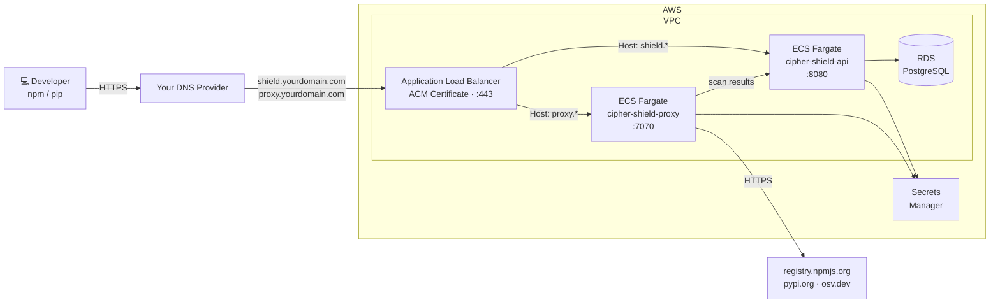

# Deploying cipher-shield on AWS

**Architecture:** ECS Fargate + RDS PostgreSQL + Application Load Balancer.  
Managed containers — no EC2 to patch, auto-restarts on crash, scales 1–4 tasks at 60% CPU.  
**Estimated cost:** ~$50–80/month (ALB ~$20/month base + Fargate + RDS).

---

## Architecture



---

## Prerequisites

- AWS CLI installed and authenticated (`aws configure`)
- Permissions to create ECS, RDS, IAM, ALB, ACM, Secrets Manager, and VPC resources
- A domain you control with access to add DNS records

---

## 1. Set variables

```bash
export AWS_REGION=us-east-1
export APP=cipher-shield
export IMAGE=ghcr.io/cipher-oss/cipher-shield:latest
export DB_NAME=shield
export DB_USER=shieldadmin
export DOMAIN=yourdomain.com   # replace with your domain
```

---

## 2. Store secrets in Secrets Manager

```bash
JWT_SECRET=$(openssl rand -hex 32)
PROXY_TOKEN=$(openssl rand -hex 32)
DB_PASSWORD=$(openssl rand -hex 16)

# Save these now — they won't be shown again and are needed in later steps
echo "JWT_SECRET=$JWT_SECRET"
echo "PROXY_TOKEN=$PROXY_TOKEN"
echo "DB_PASSWORD=$DB_PASSWORD"

aws secretsmanager create-secret --region $AWS_REGION \
  --name $APP/jwt-secret --secret-string "$JWT_SECRET"
aws secretsmanager create-secret --region $AWS_REGION \
  --name $APP/proxy-token --secret-string "$PROXY_TOKEN"

# Capture full ARNs — AWS appends a random suffix (e.g. -PBDEw4) that must be
# included in ECS task definitions; the base path alone will not work.
JWT_ARN=$(aws secretsmanager describe-secret --region $AWS_REGION \
  --secret-id $APP/jwt-secret --query ARN --output text)
PROXY_ARN=$(aws secretsmanager describe-secret --region $AWS_REGION \
  --secret-id $APP/proxy-token --query ARN --output text)
```

---

## 3. Networking — default VPC

```bash
VPC_ID=$(aws ec2 describe-vpcs --region $AWS_REGION \
  --filters Name=isDefault,Values=true \
  --query 'Vpcs[0].VpcId' --output text)

SUBNETS=$(aws ec2 describe-subnets --region $AWS_REGION \
  --filters Name=vpc-id,Values=$VPC_ID \
  --query 'Subnets[*].SubnetId' --output text | tr '\t' ',')
```

---

## 4. Security groups

```bash
# ALB — accepts HTTPS from the internet
ALB_SG=$(aws ec2 create-security-group --region $AWS_REGION \
  --group-name $APP-alb --description "$APP ALB" \
  --vpc-id $VPC_ID --query GroupId --output text)
aws ec2 authorize-security-group-ingress --region $AWS_REGION \
  --group-id $ALB_SG --protocol tcp --port 443 --cidr 0.0.0.0/0

# Tasks — only reachable from the ALB
TASK_SG=$(aws ec2 create-security-group --region $AWS_REGION \
  --group-name $APP-task --description "$APP Fargate task" \
  --vpc-id $VPC_ID --query GroupId --output text)
aws ec2 authorize-security-group-ingress --region $AWS_REGION \
  --group-id $TASK_SG --protocol tcp --port 8080 --source-group $ALB_SG
aws ec2 authorize-security-group-ingress --region $AWS_REGION \
  --group-id $TASK_SG --protocol tcp --port 7070 --source-group $ALB_SG

# Database — only reachable from the Fargate tasks
DB_SG=$(aws ec2 create-security-group --region $AWS_REGION \
  --group-name $APP-db --description "$APP RDS" \
  --vpc-id $VPC_ID --query GroupId --output text)
aws ec2 authorize-security-group-ingress --region $AWS_REGION \
  --group-id $DB_SG --protocol tcp --port 5432 --source-group $TASK_SG
```

---

## 5. Create RDS PostgreSQL

```bash
aws rds create-db-subnet-group --region $AWS_REGION \
  --db-subnet-group-name $APP-subnets \
  --db-subnet-group-description "$APP DB subnets" \
  --subnet-ids $(echo $SUBNETS | tr ',' ' ')

aws rds create-db-instance --region $AWS_REGION \
  --db-instance-identifier $APP-pg \
  --db-instance-class db.t4g.micro \
  --engine postgres --engine-version 16 \
  --master-username $DB_USER \
  --master-user-password "$DB_PASSWORD" \
  --db-name $DB_NAME \
  --vpc-security-group-ids $DB_SG \
  --db-subnet-group-name $APP-subnets \
  --no-publicly-accessible \
  --allocated-storage 20

# ~5 minutes
aws rds wait db-instance-available --region $AWS_REGION \
  --db-instance-identifier $APP-pg

DB_HOST=$(aws rds describe-db-instances --region $AWS_REGION \
  --db-instance-identifier $APP-pg \
  --query 'DBInstances[0].Endpoint.Address' --output text)

aws secretsmanager create-secret --region $AWS_REGION \
  --name $APP/db-url \
  --secret-string "postgres://${DB_USER}:${DB_PASSWORD}@${DB_HOST}:5432/${DB_NAME}?sslmode=require"

DB_URL_ARN=$(aws secretsmanager describe-secret --region $AWS_REGION \
  --secret-id $APP/db-url --query ARN --output text)
```

---

## 6. IAM execution role

```bash
ACCOUNT_ID=$(aws sts get-caller-identity --query Account --output text)

aws iam create-role --role-name $APP-exec-role \
  --assume-role-policy-document '{
    "Version":"2012-10-17",
    "Statement":[{"Effect":"Allow","Principal":{"Service":"ecs-tasks.amazonaws.com"},"Action":"sts:AssumeRole"}]
  }'

aws iam attach-role-policy --role-name $APP-exec-role \
  --policy-arn arn:aws:iam::aws:policy/service-role/AmazonECSTaskExecutionRolePolicy

aws iam put-role-policy --role-name $APP-exec-role \
  --policy-name secrets-read \
  --policy-document "{
    \"Version\":\"2012-10-17\",
    \"Statement\":[{
      \"Effect\":\"Allow\",
      \"Action\":\"secretsmanager:GetSecretValue\",
      \"Resource\":\"arn:aws:secretsmanager:${AWS_REGION}:${ACCOUNT_ID}:secret:${APP}/*\"
    }]
  }"

ROLE_ARN="arn:aws:iam::${ACCOUNT_ID}:role/${APP}-exec-role"
```

---

## 7. Request and validate an ACM certificate

```bash
CERT_ARN=$(aws acm request-certificate \
  --domain-name "shield.${DOMAIN}" \
  --subject-alternative-names "proxy.${DOMAIN}" \
  --validation-method DNS \
  --region $AWS_REGION \
  --query CertificateArn --output text)

# Print the CNAME records needed for validation
aws acm describe-certificate \
  --certificate-arn $CERT_ARN \
  --region $AWS_REGION \
  --query 'Certificate.DomainValidationOptions[*].{Domain:DomainName,Name:ResourceRecord.Name,Value:ResourceRecord.Value}' \
  --output table
```

Add the CNAME records shown in the output to your DNS provider. Then wait for ACM to validate — typically 5–30 minutes depending on DNS propagation:

```bash
aws acm wait certificate-validated \
  --certificate-arn $CERT_ARN \
  --region $AWS_REGION
echo "Certificate validated."
```

---

## 8. Create the load balancer

```bash
ALB_ARN=$(aws elbv2 create-load-balancer \
  --name $APP-alb \
  --subnets $(echo $SUBNETS | tr ',' ' ') \
  --security-groups $ALB_SG \
  --region $AWS_REGION \
  --query 'LoadBalancers[0].LoadBalancerArn' --output text)

ALB_DNS=$(aws elbv2 describe-load-balancers \
  --load-balancer-arns $ALB_ARN \
  --region $AWS_REGION \
  --query 'LoadBalancers[0].DNSName' --output text)

echo "ALB DNS: $ALB_DNS"
```

**Add two DNS records now.** In your DNS provider, point both subdomains at the ALB:

| Name | Type | Value |
|---|---|---|
| `shield.yourdomain.com` | CNAME | `$ALB_DNS` |
| `proxy.yourdomain.com` | CNAME | `$ALB_DNS` |

Then create the target groups and HTTPS listener:

```bash
# Target group for the API (port 8080)
API_TG=$(aws elbv2 create-target-group \
  --name $APP-api-tg \
  --protocol HTTP --port 8080 \
  --vpc-id $VPC_ID \
  --target-type ip \
  --health-check-path /api/v1/health \
  --region $AWS_REGION \
  --query 'TargetGroups[0].TargetGroupArn' --output text)

# Target group for the proxy (port 7070)
PROXY_TG=$(aws elbv2 create-target-group \
  --name $APP-proxy-tg \
  --protocol HTTP --port 7070 \
  --vpc-id $VPC_ID \
  --target-type ip \
  --health-check-path / \
  --region $AWS_REGION \
  --query 'TargetGroups[0].TargetGroupArn' --output text)

# HTTPS listener — default routes to API; proxy.* routes to proxy
LISTENER_ARN=$(aws elbv2 create-listener \
  --load-balancer-arn $ALB_ARN \
  --protocol HTTPS --port 443 \
  --certificates CertificateArn=$CERT_ARN \
  --default-actions Type=forward,TargetGroupArn=$API_TG \
  --region $AWS_REGION \
  --query 'Listeners[0].ListenerArn' --output text)

aws elbv2 create-rule \
  --listener-arn $LISTENER_ARN \
  --conditions '[{"Field":"host-header","HostHeaderConfig":{"Values":["proxy.'${DOMAIN}'"]}}]' \
  --priority 10 \
  --actions Type=forward,TargetGroupArn=$PROXY_TG \
  --region $AWS_REGION
```

---

## 9. Deploy the API service

ECS registers the task's private IP with the API target group automatically on startup.

```bash
aws ecs create-cluster --region $AWS_REGION --cluster-name $APP
aws logs create-log-group --region $AWS_REGION --log-group-name /ecs/$APP

cat > /tmp/task-api.json << EOF
{
  "family": "${APP}-api",
  "networkMode": "awsvpc",
  "requiresCompatibilities": ["FARGATE"],
  "cpu": "512", "memory": "1024",
  "executionRoleArn": "${ROLE_ARN}",
  "taskRoleArn": "${ROLE_ARN}",
  "containerDefinitions": [{
    "name": "${APP}-api",
    "image": "${IMAGE}",
    "portMappings": [{"containerPort": 8080}],
    "environment": [
      {"name": "SHIELD_MODE", "value": "enforce"}
    ],
    "secrets": [
      {"name": "SHIELD_JWT_SECRET",  "valueFrom": "${JWT_ARN}"},
      {"name": "SHIELD_PROXY_TOKEN", "valueFrom": "${PROXY_ARN}"},
      {"name": "DATABASE_URL",       "valueFrom": "${DB_URL_ARN}"}
    ],
    "logConfiguration": {
      "logDriver": "awslogs",
      "options": {
        "awslogs-group": "/ecs/${APP}",
        "awslogs-region": "${AWS_REGION}",
        "awslogs-stream-prefix": "api"
      }
    }
  }]
}
EOF

aws ecs register-task-definition --region $AWS_REGION --cli-input-json file:///tmp/task-api.json

aws ecs create-service --region $AWS_REGION \
  --cluster $APP --service-name ${APP}-api \
  --task-definition ${APP}-api --desired-count 1 \
  --launch-type FARGATE \
  --network-configuration "awsvpcConfiguration={
    subnets=[${SUBNETS}],
    securityGroups=[${TASK_SG}],
    assignPublicIp=ENABLED
  }" \
  --load-balancers "targetGroupArn=${API_TG},containerName=${APP}-api,containerPort=8080"

aws ecs wait services-stable --region $AWS_REGION \
  --cluster $APP --services ${APP}-api

curl https://shield.${DOMAIN}/api/v1/health
# {"status":"ok","version":"0.1.4"}
```

---

## 10. Deploy the proxy service

The proxy runs the standalone `cipher-shield-proxy` binary — no database connection needed. It ships scan results to the API via `SHIELD_SERVER_URL`.

```bash
cat > /tmp/task-proxy.json << EOF
{
  "family": "${APP}-proxy",
  "networkMode": "awsvpc",
  "requiresCompatibilities": ["FARGATE"],
  "cpu": "512", "memory": "1024",
  "executionRoleArn": "${ROLE_ARN}",
  "taskRoleArn": "${ROLE_ARN}",
  "containerDefinitions": [{
    "name": "${APP}-proxy",
    "image": "${IMAGE}",
    "entryPoint": ["cipher-shield-proxy"],
    "portMappings": [{"containerPort": 7070}],
    "environment": [
      {"name": "SHIELD_MODE",       "value": "enforce"},
      {"name": "SHIELD_SERVER_URL", "value": "https://shield.${DOMAIN}"}
    ],
    "secrets": [
      {"name": "SHIELD_PROXY_TOKEN", "valueFrom": "${PROXY_ARN}"}
    ],
    "logConfiguration": {
      "logDriver": "awslogs",
      "options": {
        "awslogs-group": "/ecs/${APP}",
        "awslogs-region": "${AWS_REGION}",
        "awslogs-stream-prefix": "proxy"
      }
    }
  }]
}
EOF

aws ecs register-task-definition --region $AWS_REGION --cli-input-json file:///tmp/task-proxy.json

aws ecs create-service --region $AWS_REGION \
  --cluster $APP --service-name ${APP}-proxy \
  --task-definition ${APP}-proxy --desired-count 1 \
  --launch-type FARGATE \
  --network-configuration "awsvpcConfiguration={
    subnets=[${SUBNETS}],
    securityGroups=[${TASK_SG}],
    assignPublicIp=ENABLED
  }" \
  --load-balancers "targetGroupArn=${PROXY_TG},containerName=${APP}-proxy,containerPort=7070"

aws ecs wait services-stable --region $AWS_REGION \
  --cluster $APP --services ${APP}-proxy
```

---

## 11. Auto-scaling

```bash
for SVC in ${APP}-api ${APP}-proxy; do
  aws application-autoscaling register-scalable-target \
    --service-namespace ecs \
    --resource-id service/$APP/$SVC \
    --scalable-dimension ecs:service:DesiredCount \
    --min-capacity 1 --max-capacity 4

  aws application-autoscaling put-scaling-policy \
    --service-namespace ecs \
    --resource-id service/$APP/$SVC \
    --scalable-dimension ecs:service:DesiredCount \
    --policy-name cpu-scaling \
    --policy-type TargetTrackingScaling \
    --target-tracking-scaling-policy-configuration '{
      "TargetValue": 60.0,
      "PredefinedMetricSpecification": {"PredefinedMetricType": "ECSServiceAverageCPUUtilization"},
      "ScaleInCooldown": 60,
      "ScaleOutCooldown": 30
    }'
done
```

---

## 12. Bootstrap the first admin user

```bash
ADMIN_PASSWORD=$(openssl rand -hex 12)
echo "Admin password: $ADMIN_PASSWORD — save this before proceeding"
curl -X POST https://shield.${DOMAIN}/api/v1/users \
  -H "Content-Type: application/json" \
  -d "{\"email\":\"admin@yourcompany.com\",\"password\":\"${ADMIN_PASSWORD}\",\"role\":\"admin\"}"
```

Open `https://shield.${DOMAIN}` and log in.

This endpoint is open when the users table is empty; the first user is forced to `admin`. After that, it requires an admin JWT.

---

## 13. Configure dev machines

**Option A — centralized proxy (no cipher-shield install required on each machine)**

Point npm and pip at your proxy domain. All installs are intercepted and scanned at the server.

```bash
npm config set registry https://proxy.${DOMAIN}/
pip config set global.index-url https://proxy.${DOMAIN}/simple/
```

Push this via MDM, Ansible, or your onboarding scripts. Scan results appear on the dashboard at `https://shield.${DOMAIN}` automatically.

**Option B — local proxy reporting to central server**

Developers install cipher-shield locally. The local proxy handles interception and ships results to the central server.

```bash
export SHIELD_SERVER_URL=https://shield.${DOMAIN}
export SHIELD_PROXY_TOKEN=<PROXY_TOKEN from step 2>
cipher-shield proxy start
```

---

## Corporate proxies and secure web gateways

If your organization runs Cisco Umbrella, Zscaler, Netskope, or a similar SWG, see **[Network and corporate proxy requirements →](network.md)** for the one-time policy changes needed to allow cipher-shield traffic through.

---

## Teardown

Delete in this order — resources must be removed before their dependencies.

```bash
# Scale down then delete ECS services
aws ecs update-service --region $AWS_REGION --cluster $APP --service ${APP}-api   --desired-count 0
aws ecs update-service --region $AWS_REGION --cluster $APP --service ${APP}-proxy --desired-count 0
aws ecs wait services-stable --region $AWS_REGION --cluster $APP \
  --services ${APP}-api ${APP}-proxy
aws ecs delete-service --region $AWS_REGION --cluster $APP --service ${APP}-api   --force
aws ecs delete-service --region $AWS_REGION --cluster $APP --service ${APP}-proxy --force
aws ecs delete-cluster --region $AWS_REGION --cluster $APP

# Remove load balancer and target groups
aws elbv2 delete-load-balancer --load-balancer-arn $ALB_ARN --region $AWS_REGION
aws elbv2 wait load-balancers-deleted --load-balancer-arns $ALB_ARN --region $AWS_REGION
aws elbv2 delete-target-group --target-group-arn $API_TG   --region $AWS_REGION
aws elbv2 delete-target-group --target-group-arn $PROXY_TG --region $AWS_REGION

# Remove RDS (~5 minutes)
aws rds delete-db-instance --region $AWS_REGION \
  --db-instance-identifier $APP-pg --skip-final-snapshot
aws rds wait db-instance-deleted --region $AWS_REGION \
  --db-instance-identifier $APP-pg
aws rds delete-db-subnet-group --region $AWS_REGION --db-subnet-group-name $APP-subnets

# Remove security groups (revoke cross-references first)
aws ec2 revoke-security-group-ingress --region $AWS_REGION \
  --group-id $DB_SG --protocol tcp --port 5432 --source-group $TASK_SG
aws ec2 revoke-security-group-ingress --region $AWS_REGION \
  --group-id $TASK_SG --protocol tcp --port 8080 --source-group $ALB_SG
aws ec2 revoke-security-group-ingress --region $AWS_REGION \
  --group-id $TASK_SG --protocol tcp --port 7070 --source-group $ALB_SG
aws ec2 delete-security-group --region $AWS_REGION --group-id $DB_SG
aws ec2 delete-security-group --region $AWS_REGION --group-id $TASK_SG
aws ec2 delete-security-group --region $AWS_REGION --group-id $ALB_SG

# Remove IAM role and policies
aws iam detach-role-policy --role-name $APP-exec-role \
  --policy-arn arn:aws:iam::aws:policy/service-role/AmazonECSTaskExecutionRolePolicy
aws iam delete-role-policy --role-name $APP-exec-role --policy-name secrets-read
aws iam delete-role --role-name $APP-exec-role

# Remove certificate, log group, and secrets
aws acm delete-certificate --certificate-arn $CERT_ARN --region $AWS_REGION
aws logs delete-log-group --region $AWS_REGION --log-group-name /ecs/$APP
aws secretsmanager delete-secret --region $AWS_REGION \
  --secret-id $APP/jwt-secret  --force-delete-without-recovery
aws secretsmanager delete-secret --region $AWS_REGION \
  --secret-id $APP/proxy-token --force-delete-without-recovery
aws secretsmanager delete-secret --region $AWS_REGION \
  --secret-id $APP/db-url      --force-delete-without-recovery
```
