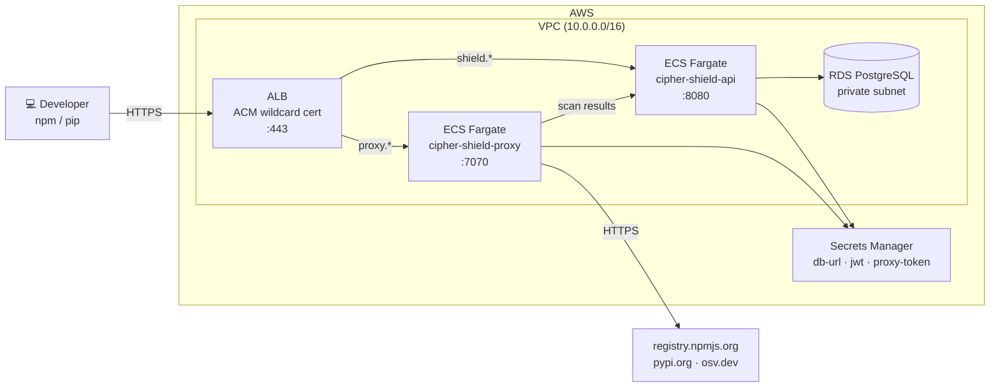

# Deploying cipher-shield on AWS

**Architecture:** ECS Fargate + RDS PostgreSQL + Application Load Balancer.  
Managed containers — no EC2 to patch, auto-restarts on crash.  
**Estimated cost:** ~$50–80/month (ALB ~$20/month base + Fargate + RDS).



---

## Prerequisites

- [Terraform](https://developer.hashicorp.com/terraform/install) ≥ 1.6
- AWS CLI configured with permissions to create ECS, RDS, IAM, ALB, ACM, Secrets Manager, and VPC resources
- A domain you control with access to add DNS records

---

## Deploy

The Terraform module is included in this repo under `infra/aws/`.

```bash
cd infra/aws
cp terraform.tfvars.example terraform.tfvars
```

Fill in `terraform.tfvars`:

```hcl
db_password       = "$(openssl rand -hex 16)"
jwt_secret        = "$(openssl rand -hex 32)"
proxy_token       = "$(openssl rand -hex 32)"
anthropic_api_key = ""        # optional — enables Claude SAST analysis
image_tag         = "0.1.5"   # use the latest release tag
aws_region        = "us-east-1"
```

> Save `terraform.tfvars` somewhere safe — these secrets are not recoverable after `terraform apply` without modifying the running infrastructure.

**Step 1 — create the certificate, then add the DNS validation record:**

```bash
terraform init
terraform apply -target=aws_acm_certificate.shield
```

Terraform outputs the CNAME record needed for ACM DNS validation. Add it to your DNS provider, then wait for propagation before continuing.

**Step 2 — deploy everything else:**

```bash
terraform apply
```

This creates the VPC, RDS, ECS services, ALB, and wires the certificate to the listener. Takes ~10 minutes (RDS dominates).

---

## DNS

After `terraform apply` completes, add two CNAME records pointing at the ALB:

```bash
terraform output alb_dns_name
```

| Record | Type | Value |
|---|---|---|
| `shield.yourdomain.com` | CNAME | ALB DNS name |
| `proxy.yourdomain.com` | CNAME | ALB DNS name |

---

## Bootstrap the first admin user

The `/api/v1/users` endpoint is open when the users table is empty. The first user created is forced to `admin`.

```bash
curl -X POST https://shield.yourdomain.com/api/v1/users \
  -H "Content-Type: application/json" \
  -d '{"email":"admin@yourcompany.com","password":"...","role":"admin"}'
```

Open `https://shield.yourdomain.com` and log in.

---

## Configure developer machines

```bash
# Point npm at cipher-shield (run on each developer machine, or push via MDM/Ansible)
npm config set registry https://proxy.yourdomain.com/

# Point pip at cipher-shield
pip config set global.index-url https://proxy.yourdomain.com/simple/
```

Scan results appear in the dashboard at `https://shield.yourdomain.com` automatically.

> **Corporate proxies and SWGs:** If your organization runs Cisco Umbrella, Zscaler, Netskope, or a corporate HTTP proxy, see [network.md](network.md) for the one-time policy changes needed.

---

## Upgrade

To deploy a new cipher-shield release, update `image_tag` in `terraform.tfvars` and run:

```bash
terraform apply
```

ECS performs a rolling update with no downtime.

---

## Teardown

```bash
terraform destroy
```

Deletes all resources created by `terraform apply` — ECS services, RDS, ALB, VPC, Secrets Manager entries, and the ACM certificate.

---

## Manual deployment

If you prefer not to use Terraform, see [deploy-aws-manual.md](deploy-aws-manual.md) for a step-by-step AWS CLI walkthrough that creates the same infrastructure.
