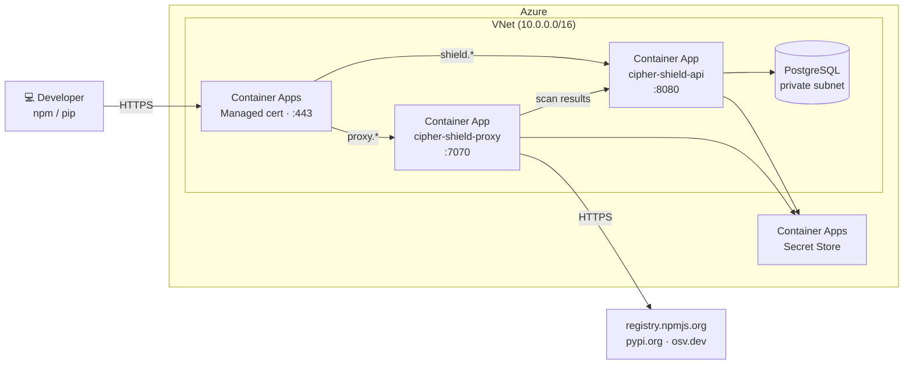

# Deploying cipher-shield on Azure (Terraform)

**Architecture:** Azure Container Apps + Azure Database for PostgreSQL Flexible Server.  
Managed containers inside a private VNet — no VMs, scales to zero, auto-restarts on crash.  
**Estimated cost:** ~$20–40/month at low traffic.



---

## Prerequisites

- [Terraform](https://developer.hashicorp.com/terraform/install) ≥ 1.6
- Azure CLI installed and authenticated (`az login`)
- A domain you control with access to add DNS records

---

## Deploy

The Terraform module is included in this repo under `infra/azure/`.

```bash
cd infra/azure
cp terraform.tfvars.example terraform.tfvars
```

Generate secrets and fill in `terraform.tfvars`:

```bash
cat > terraform.tfvars << EOF
domain            = "yourdomain.com"
db_password       = "$(openssl rand -hex 16)"
jwt_secret        = "$(openssl rand -hex 32)"
proxy_token       = "$(openssl rand -hex 32)"
anthropic_api_key = ""
image_tag         = "0.1.5"
EOF
```

> Save `terraform.tfvars` somewhere safe — these secrets are not recoverable after `terraform apply` without modifying the running infrastructure.

**Step 1 — deploy the Container Apps environment and get CNAME targets:**

```bash
terraform init
terraform apply
```

Once complete, get the CNAME targets from the output:

```bash
terraform output api_fqdn
terraform output proxy_fqdn
```

**Step 2 — add DNS records, then apply again to bind certificates:**

Add two CNAME records to your DNS provider:

| Record | Type | Value |
|---|---|---|
| `shield.yourdomain.com` | CNAME | value of `api_fqdn` |
| `proxy.yourdomain.com` | CNAME | value of `proxy_fqdn` |

Wait for DNS propagation (5–15 minutes), then run:

```bash
terraform apply
```

This second apply provisions the Let's Encrypt managed certificates and binds the custom domains. Azure validates ownership via the CNAME records.

---

## Bootstrap the first admin user

The `/api/v1/users` endpoint is open when the users table is empty. The first user created is forced to `admin`.

```bash
curl -X POST https://shield.yourdomain.com/api/v1/users \
  -H "Content-Type: application/json" \
  -d '{"email":"admin@yourcompany.com","password":"...","role":"admin"}'
```

Open `https://shield.yourdomain.com` and log in.

---

## Configure developer machines

```bash
# Point npm at cipher-shield (run on each developer machine, or push via MDM/Ansible)
npm config set registry https://proxy.yourdomain.com/

# Point pip at cipher-shield
pip config set global.index-url https://proxy.yourdomain.com/simple/
```

Scan results appear in the dashboard at `https://shield.yourdomain.com` automatically.

> **Corporate proxies and SWGs:** If your organization runs Cisco Umbrella, Zscaler, Netskope, or a corporate HTTP proxy, see [network.md](network.md) for the one-time policy changes needed.

---

## Upgrade

Update `image_tag` in `terraform.tfvars` and run:

```bash
terraform apply
```

Container Apps performs a zero-downtime revision rollout.

---

## Teardown

```bash
terraform destroy
```

Deletes all resources — Container Apps, PostgreSQL, VNet, managed certificates, and the resource group.

---

## Manual deployment

If you prefer not to use Terraform, see [deploy-azure.md](deploy-azure.md) for a step-by-step Azure CLI walkthrough.
