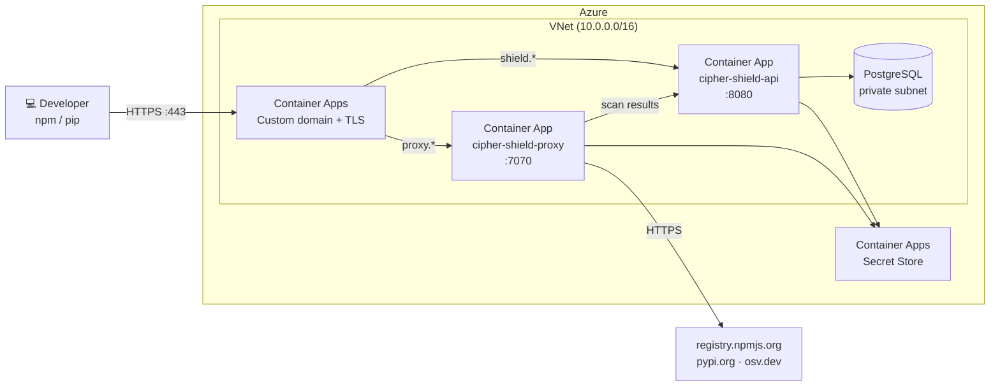

# Deploying cipher-shield on Azure (Terraform)

**Architecture:** Azure Container Apps + Azure Database for PostgreSQL Flexible Server.  
Managed containers inside a private VNet — no VMs, scales to zero, auto-restarts on crash.  
**Estimated cost:** ~$20–40/month at low traffic.


```mermaid
flowchart LR
    dev["💻 Developer\nnpm / pip"] -->|HTTPS :443| aca

    subgraph azure [" Azure "]
        subgraph vnet [" VNet (10.0.0.0/16) "]
            aca["Container Apps\nCustom domain + TLS"]
            aca -->|"shield.*"| api["Container App\ncipher-shield-api\n:8080"]
            aca -->|"proxy.*"| proxy["Container App\ncipher-shield-proxy\n:7070"]
            proxy -->|scan results| api
            api --> pg[("PostgreSQL\nprivate subnet")]
        end
        api & proxy --> store["Container Apps\nSecret Store"]
    end

    proxy -->|HTTPS| reg["registry.npmjs.org\npypi.org · osv.dev"]
```

---

## Prerequisites

- [Terraform](https://developer.hashicorp.com/terraform/install) ≥ 1.6
- Azure CLI installed and authenticated:
  ```bash
  az login
  az account set --subscription "your-subscription-id"
  ```
- A domain you control with access to add DNS records

---

## Deploy

```bash
cd infra/azure
cp terraform.tfvars.example terraform.tfvars
```

Generate secrets and fill in `terraform.tfvars`:

```bash
cat > terraform.tfvars << EOF
domain            = "yourdomain.com"
db_password       = "$(openssl rand -hex 32)"
jwt_secret        = "$(openssl rand -hex 32)"
proxy_token       = "$(openssl rand -hex 32)"
anthropic_api_key = ""
image_tag         = "1.3.0"
EOF
```

> Save `terraform.tfvars` to a password manager or secrets vault before continuing. These values are not recoverable after `terraform apply` without modifying the running infrastructure.

> **Terraform state stores secrets in plaintext.** `terraform.tfstate` contains all sensitive values (database URL with credentials, JWT secret, proxy token) as cleartext JSON — the `sensitive = true` marker only suppresses console output, it does not encrypt state. For production deployments, use a remote backend with server-side encryption: an Azure Storage Account with CMK, or Terraform Cloud. Never commit state files to source control.

**Step 1 — deploy the Container Apps environment:**

```bash
terraform init
terraform apply
```

Once complete, get the Container App hostnames Terraform needs for DNS:

```bash
terraform output api_fqdn    # cipher-shield-api.<env-domain>
terraform output proxy_fqdn  # cipher-shield-proxy.<env-domain>
```

**Step 2 — add DNS records:**

Add two CNAME records in your DNS provider (DNS-only, not proxied if using Cloudflare):

| Record | Type | Value |
|---|---|---|
| `shield.yourdomain.com` | CNAME | value of `api_fqdn` |
| `proxy.yourdomain.com` | CNAME | value of `proxy_fqdn` |

Wait for DNS propagation (5–15 minutes) before continuing.

**Step 3 — bind custom domains and provision TLS certificates:**

Azure Container Apps does not support Terraform-managed certificates in the `azurerm` 3.x provider. Configure custom domains through the Azure portal:

1. In the [Azure portal](https://portal.azure.com), open the **Container Apps Environment**.
2. Under **Custom domains**, add `shield.yourdomain.com`. Azure validates ownership via the CNAME record and provisions a free Let's Encrypt certificate automatically.
3. Repeat for `proxy.yourdomain.com`.
4. In each Container App (`cipher-shield-api` and `cipher-shield-proxy`), bind the certificate to the custom domain.

> Cert provisioning typically takes 5–10 minutes after the CNAME resolves. The Container App remains accessible at its default `*.azurecontainerapps.io` hostname while the cert is being provisioned.

---

## First login

Set `admin_email` and `admin_password` in `terraform.tfvars` before the first `terraform apply`. The server creates the admin account on first startup.

Open `https://shield.yourdomain.com` and log in. After confirming access, remove `admin_password` from `terraform.tfvars` and run `terraform apply` again — Terraform will remove the secret and update the container app.

---

## Configure developer machines

```bash
# Point npm at cipher-shield (run on each developer machine, or push via MDM/Ansible)
npm config set registry https://proxy.yourdomain.com/

# Point pip at cipher-shield
pip config set global.index-url https://proxy.yourdomain.com/simple/
```

Scan results appear in the dashboard at `https://shield.yourdomain.com` automatically.

> **Corporate proxies and SWGs:** If your organization runs Cisco Umbrella, Zscaler, Netskope, or a corporate HTTP proxy, see [network.md](network.md) for the one-time policy changes needed.

---

## Enforcement mode and failure behavior

cipher-shield is **fail-open**: if the scan pipeline errors or times out (45-second limit per package), the install is allowed through. This is a deliberate tradeoff — fail-closed would block all package installs during any API outage, which is too disruptive for developer machines on the critical path.

The `shield_mode` variable controls what happens when a threat is detected:

| Mode | Threat detected | Analysis error / timeout |
|---|---|---|
| `enforce` | Install blocked with 403 | Install allowed through |
| `warn` | Install allowed, warning logged | Install allowed through |

Switch modes without redeploying the container by updating `shield_mode` in `terraform.tfvars` and running `terraform apply`. Use `warn` mode during an initial rollout to validate coverage before enabling blocking.

---

## Scaling

By default both containers scale to a maximum of 10 replicas. Override in `terraform.tfvars`:

```hcl
api_max_count   = 20   # max API container replicas
proxy_max_count = 20   # max proxy container replicas (CPU-bound — scale this first under load)
```

Minimum is always 1 (keeps cold-start latency out of the install path).

---

## Upgrade

Update `image_tag` in `terraform.tfvars` and run:

```bash
terraform apply
```

Container Apps performs a zero-downtime revision rollout.

---

## Teardown

```bash
terraform destroy
```

Deletes all Terraform-managed resources: Container Apps, Container Apps Environment, PostgreSQL Flexible Server, VNet, and the resource group.

> Custom domain bindings and managed certificates added via the Azure portal are **not** tracked in Terraform state and must be removed manually before `terraform destroy` — otherwise the resource group deletion may fail. In the portal, remove the custom domain bindings from each Container App and delete the managed certificates from the Container Apps Environment first.

---

## Troubleshooting

**Custom domain validation stuck**

If Azure can't validate the custom domain:

1. Confirm the CNAME is resolving:
   ```bash
   dig +short shield.yourdomain.com
   ```
   The response should be the Container App FQDN, not your domain.

2. If using Cloudflare, confirm the record is **DNS only** (grey cloud icon), not proxied (orange). Cloudflare proxying changes the TLS fingerprint and interferes with Azure's CNAME validation.

3. Wait up to 30 minutes — Azure's validation retry cycle is slow.

**`az login` vs application default credentials**

Terraform uses the Azure CLI session for authentication. Run `az login` and set the correct subscription with `az account set --subscription ...` before running `terraform init` or `terraform apply`.

**PostgreSQL firewall blocking Terraform**

The PostgreSQL Flexible Server is private (no public endpoint). Terraform communicates with it via the VNet. If `terraform apply` hangs on database schema creation, check that the VNet peering between the Container Apps environment and the database subnet has fully propagated.

---

## Manual deployment

If you prefer not to use Terraform, see [deploy-azure.md](deploy-azure.md) for a step-by-step Azure CLI walkthrough.
