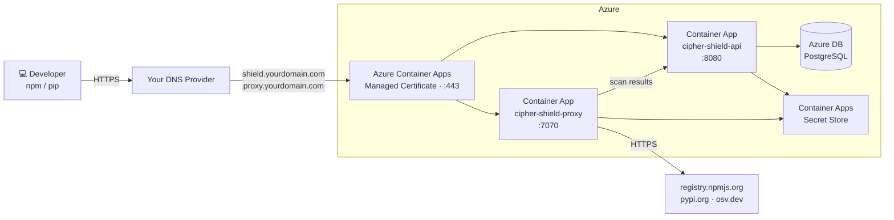

# Deploying cipher-shield on Azure

**Architecture:** Azure Container Apps + Azure Database for PostgreSQL.  
Managed containers — no VMs to manage, scales to zero when idle, auto-restarts on crash.  
**Estimated cost:** ~$20–40/month at low traffic.

---

## Architecture



---

## Prerequisites

- Azure CLI installed and authenticated (`az login`)
- An Azure subscription
- A domain you control with access to add DNS records

---

## 1. Set variables

```bash
export RG=cipher-shield-rg
export LOCATION=eastus
export DB_SERVER=cipher-shield-db
export DB_NAME=shield
export DB_USER=shieldadmin
export ACA_ENV=cipher-shield-env
export DOMAIN=yourdomain.com   # replace with your domain
```

---

## 2. Create resource group

```bash
az group create --name $RG --location $LOCATION
```

---

## 3. Generate secrets

```bash
JWT_SECRET=$(openssl rand -hex 32)
PROXY_TOKEN=$(openssl rand -hex 32)
DB_PASSWORD=$(openssl rand -hex 16)
```

---

## 4. Create Azure Database for PostgreSQL

```bash
az postgres flexible-server create \
  --resource-group $RG \
  --name $DB_SERVER \
  --location $LOCATION \
  --admin-user $DB_USER \
  --admin-password "$DB_PASSWORD" \
  --sku-name Standard_B1ms \
  --tier Burstable \
  --storage-size 32 \
  --version 16 \
  --public-access 0.0.0.0

az postgres flexible-server db create \
  --resource-group $RG \
  --server-name $DB_SERVER \
  --database-name $DB_NAME

DB_HOST=$(az postgres flexible-server show \
  --resource-group $RG --name $DB_SERVER \
  --query fullyQualifiedDomainName --output tsv)
echo "DB_HOST=$DB_HOST"
```

> `--public-access 0.0.0.0` allows connections from any Azure service. For production, use VNet integration to restrict access to only your Container Apps environment.

---

## 5. Create the Container Apps environment

```bash
az containerapp env create \
  --name $ACA_ENV \
  --resource-group $RG \
  --location $LOCATION

ENV_DOMAIN=$(az containerapp env show \
  --name $ACA_ENV --resource-group $RG \
  --query properties.defaultDomain --output tsv)
echo "ENV_DOMAIN=$ENV_DOMAIN"
```

---

## 6. Deploy the API / dashboard (port 8080)

Secrets are stored in Container Apps' encrypted secret store, not as plain environment variables:

```bash
DB_URL="postgres://${DB_USER}:${DB_PASSWORD}@${DB_HOST}:5432/${DB_NAME}?sslmode=require"

az containerapp create \
  --name cipher-shield-api \
  --resource-group $RG \
  --environment $ACA_ENV \
  --image ghcr.io/cipher-oss/cipher-shield:latest \
  --target-port 8080 \
  --ingress external \
  --min-replicas 1 --max-replicas 4 \
  --scale-rule-name cpu-rule \
  --scale-rule-type cpu \
  --scale-rule-metadata type=Utilization value=60 \
  --secrets \
    "jwt-secret=${JWT_SECRET}" \
    "proxy-token=${PROXY_TOKEN}" \
    "db-url=${DB_URL}" \
  --env-vars \
    SHIELD_MODE=enforce \
    SHIELD_JWT_SECRET=secretref:jwt-secret \
    SHIELD_PROXY_TOKEN=secretref:proxy-token \
    DATABASE_URL=secretref:db-url

API_URL=$(az containerapp show \
  --name cipher-shield-api --resource-group $RG \
  --query properties.configuration.ingress.fqdn --output tsv)
echo "API URL: https://$API_URL"
```

---

## 7. Deploy the package proxy (port 7070)

The proxy runs the standalone `cipher-shield-proxy` binary from the same image — no direct database connection needed. It ships scan results to the API over HTTPS.

```bash
az containerapp create \
  --name cipher-shield-proxy \
  --resource-group $RG \
  --environment $ACA_ENV \
  --image ghcr.io/cipher-oss/cipher-shield:latest \
  --target-port 7070 \
  --ingress external \
  --min-replicas 1 --max-replicas 4 \
  --scale-rule-name cpu-rule \
  --scale-rule-type cpu \
  --scale-rule-metadata type=Utilization value=60 \
  --command "cipher-shield-proxy" \
  --secrets \
    "proxy-token=${PROXY_TOKEN}" \
  --env-vars \
    SHIELD_MODE=enforce \
    SHIELD_SERVER_URL=https://${API_URL} \
    SHIELD_PROXY_TOKEN=secretref:proxy-token

PROXY_URL=$(az containerapp show \
  --name cipher-shield-proxy --resource-group $RG \
  --query properties.configuration.ingress.fqdn --output tsv)
echo "Proxy URL: https://$PROXY_URL"
```

---

## 8. Verify

```bash
curl https://$API_URL/api/v1/health
# {"status":"ok","version":"0.1.4"}
```

---

## 9. Bootstrap the first admin user

```bash
ADMIN_PASSWORD=$(openssl rand -hex 12)
echo "Admin password: $ADMIN_PASSWORD — save this before proceeding"
curl -X POST https://$API_URL/api/v1/users \
  -H "Content-Type: application/json" \
  -d "{\"email\":\"admin@yourcompany.com\",\"password\":\"${ADMIN_PASSWORD}\",\"role\":\"admin\"}"
```

This endpoint is open when the users table is empty; the first user is forced to `admin`.

---

## 10. Map custom domains

Azure Container Apps provisions a free Let's Encrypt certificate automatically once the CNAME records are in place. DNS must be added **before** running the bind commands, as Azure validates ownership via the CNAME during binding.

**Get the CNAME targets:**

```bash
echo "Add these CNAME records to your DNS provider:"
echo "  shield.${DOMAIN}  →  cipher-shield-api.${ENV_DOMAIN}"
echo "  proxy.${DOMAIN}   →  cipher-shield-proxy.${ENV_DOMAIN}"
```

Add both records to your DNS provider and wait for propagation (typically 5–15 minutes). Then bind the managed certificates:

```bash
az containerapp hostname bind \
  --hostname shield.${DOMAIN} \
  --name cipher-shield-api \
  --resource-group $RG \
  --environment $ACA_ENV \
  --validation-method CNAME

az containerapp hostname bind \
  --hostname proxy.${DOMAIN} \
  --name cipher-shield-proxy \
  --resource-group $RG \
  --environment $ACA_ENV \
  --validation-method CNAME
```

**Verify the bindings are active:**

```bash
az containerapp hostname list \
  --name cipher-shield-api --resource-group $RG --output table

az containerapp hostname list \
  --name cipher-shield-proxy --resource-group $RG --output table
```

Both should show `bindingType: SniEnabled` when the certificate has been issued.

**Update the proxy to use the stable custom domain:**

```bash
az containerapp update \
  --name cipher-shield-proxy \
  --resource-group $RG \
  --set-env-vars \
    SHIELD_MODE=enforce \
    SHIELD_SERVER_URL=https://shield.${DOMAIN} \
    SHIELD_PROXY_TOKEN=secretref:proxy-token
```

---

## 11. Configure dev machines

**Option A — centralized proxy (no cipher-shield install required on each machine):**

```bash
npm config set registry https://proxy.${DOMAIN}/
pip config set global.index-url https://proxy.${DOMAIN}/simple/
```

Push this via MDM, Ansible, or your onboarding scripts. Scan results appear on the dashboard at `https://shield.${DOMAIN}` automatically.

**Option B — local proxy reporting to central server:**

```bash
export SHIELD_SERVER_URL=https://shield.${DOMAIN}
export SHIELD_PROXY_TOKEN=<PROXY_TOKEN from step 3>
cipher-shield proxy start
```

This starts a local proxy on `127.0.0.1:7070`, configures npm and pip automatically, and reports all results to the cloud server. No need to deploy the proxy Container App (step 7) if using this option.

---

## Scaling behavior

Both Container Apps scale from 1 to 4 replicas at 60% CPU. You can adjust at any time:

```bash
az containerapp update \
  --name cipher-shield-api \
  --resource-group $RG \
  --min-replicas 0 \
  --max-replicas 10
```

Setting `--min-replicas 0` enables scale-to-zero (useful for dev environments). Keep the proxy at `--min-replicas 1` so installs aren't delayed by cold start.

---

## Corporate proxies and secure web gateways

If your organization runs Cisco Umbrella, Zscaler, Netskope, or a similar SWG, see **[Network and corporate proxy requirements →](network.md)** for the one-time policy changes needed to allow cipher-shield traffic through.

---

## Teardown

```bash
az containerapp hostname delete \
  --hostname shield.${DOMAIN} --name cipher-shield-api --resource-group $RG --yes
az containerapp hostname delete \
  --hostname proxy.${DOMAIN} --name cipher-shield-proxy --resource-group $RG --yes
az containerapp delete --name cipher-shield-api   --resource-group $RG --yes
az containerapp delete --name cipher-shield-proxy --resource-group $RG --yes
az containerapp env delete --name $ACA_ENV --resource-group $RG --yes
az postgres flexible-server delete --resource-group $RG --name $DB_SERVER --yes
az group delete --name $RG --yes
```
