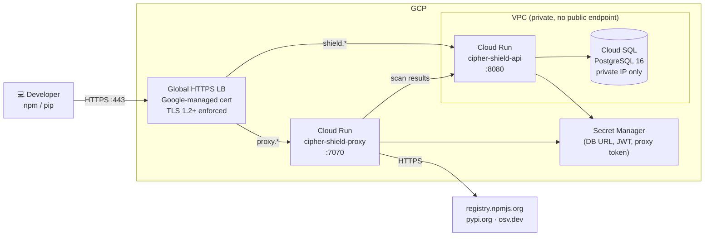

# Deploying cipher-shield on GCP (Terraform)

**Architecture:** Cloud Run + Cloud SQL PostgreSQL + Global HTTPS Load Balancer.  
Serverless containers with Google-managed TLS. The database has no public IP — Cloud Run reaches it through a VPC connector.  
**Estimated cost:** ~$10–20/month (Cloud SQL f1-micro ~$9/month always-on; Cloud Run billed per-request beyond free tier).



---

## Prerequisites

- [Terraform](https://developer.hashicorp.com/terraform/install) ≥ 1.6
- `gcloud` CLI installed and **two separate auth steps** (both are required):
  ```bash
  gcloud auth login                          # your user account for gcloud commands
  gcloud auth application-default login      # credentials Terraform uses to call GCP APIs
  ```
- A GCP project with **billing enabled** — Cloud SQL will not provision without it
- A domain you control with access to add DNS records

---

## GCP vs AWS: A records, not CNAMEs

If you've deployed on AWS, note one key difference:

- **AWS** — the ALB gives you a hostname. You add **CNAME records** in your DNS provider pointing at that hostname. ACM validates the cert via its own CNAME records you add separately.
- **GCP** — the Global LB gives you a **static IP address**. You add **A records** pointing at that IP. Google-managed certs validate by resolving your domain to that IP and probing it — there are no separate validation records to add.

This means DNS must be pointing at the correct IP *before* the cert is created. The deploy steps below enforce that sequence.

---

## Deploy

```bash
cd infra/gcp
cp terraform.tfvars.example terraform.tfvars
```

Generate secrets and fill in `terraform.tfvars`:

```bash
cat > terraform.tfvars << EOF
gcp_project = "your-gcp-project-id"
gcp_region  = "us-central1"
domain      = "yourdomain.com"

db_admin_user = "shieldadmin"
db_password   = "$(openssl rand -hex 32)"
jwt_secret    = "$(openssl rand -hex 32)"
proxy_token   = "$(openssl rand -hex 32)"

anthropic_api_key = ""
image_tag           = "1.0.0"  # check github.com/Cipher-OSS/cipher-shield/releases for latest
shield_mode         = "enforce"
deletion_protection = true
EOF
```

> Save `terraform.tfvars` to a password manager or secrets vault before continuing. These values are not recoverable from GCP after apply without modifying the running infrastructure.

> **Terraform state stores secrets in plaintext.** `terraform.tfstate` contains all sensitive values (database URL with credentials, JWT secret, proxy token) as cleartext JSON — the `sensitive = true` marker only suppresses console output, it does not encrypt state. For production deployments, use a remote backend with server-side encryption: a GCS bucket with CMEK, or Terraform Cloud. Never commit state files to source control.

---

### Stage 1 — reserve the static IP

```bash
terraform init
terraform apply -target=google_compute_global_address.shield
```

Get the reserved IP:

```bash
terraform output lb_ip_address
```

---

### Stage 2 — add DNS A records

Add two **A records** (not CNAMEs) in your DNS provider pointing at the IP from Stage 1:

| Record | Type | Value |
|---|---|---|
| `shield.yourdomain.com` | A | IP from `lb_ip_address` |
| `proxy.yourdomain.com` | A | IP from `lb_ip_address` |

Verify propagation before continuing:

```bash
dig +short shield.yourdomain.com   # should return the LB IP
dig +short proxy.yourdomain.com    # same IP
```

> If you run Stage 3 before DNS resolves to the LB IP, the Google-managed cert will get stuck in `FAILED_NOT_VISIBLE`. If that happens, see [Troubleshooting](#troubleshooting) below.

---

### Stage 3 — deploy the full stack

```bash
terraform apply
```

This creates Cloud SQL, Cloud Run services, the VPC connector, Secret Manager entries, and the Global Load Balancer with the managed cert.

> Cloud SQL takes 10–15 minutes to provision. The full apply takes around 15–20 minutes. The `timeouts` block in the Terraform config accounts for this — Terraform will not time out early.

Once apply completes, the Google-managed cert begins validation. This typically takes 10–20 minutes after DNS has propagated. Check status:

```bash
gcloud compute ssl-certificates describe cipher-shield-cert \
  --global --format="value(managed.status,managed.domainStatus)"
```

Wait for both domains to show `ACTIVE` before proceeding.

---

## Bootstrap the first admin user

Once the certificate is active, create the first admin account. Use `read -s` to avoid the password appearing in shell history:

```bash
read -s -p "Admin password: " ADMIN_PASS && echo
curl -X POST https://shield.yourdomain.com/api/v1/users \
  -H "Content-Type: application/json" \
  -d "{\"email\":\"admin@yourcompany.com\",\"password\":\"$ADMIN_PASS\",\"role\":\"admin\"}"
unset ADMIN_PASS
```

The first user is automatically granted `admin` regardless of the role field. This endpoint requires no authentication when the users table is empty and closes automatically once the first user exists.

Open `https://shield.yourdomain.com` and log in.

---

## Configure developer machines

```bash
# Point npm at cipher-shield (run on each developer machine, or push via MDM/Ansible)
npm config set registry https://proxy.yourdomain.com/

# Point pip at cipher-shield
pip config set global.index-url https://proxy.yourdomain.com/simple/
```

Scan results appear in the dashboard at `https://shield.yourdomain.com` automatically.

> **Corporate proxies and SWGs:** If your organization runs Cisco Umbrella, Zscaler, Netskope, or a corporate HTTP proxy, see [network.md](network.md) for the one-time policy changes needed.

---

## Enforcement mode and failure behavior

cipher-shield is **fail-open**: if the scan pipeline errors or times out (45-second limit per package), the install is allowed through. This is a deliberate tradeoff — fail-closed would block all package installs during any API outage, which is too disruptive for developer machines on the critical path.

The `shield_mode` variable controls what happens when a threat is detected:

| Mode | Threat detected | Analysis error / timeout |
|---|---|---|
| `enforce` | Install blocked with 403 | Install allowed through |
| `warn` | Install allowed, warning logged | Install allowed through |

Switch modes without redeploying the container by updating `shield_mode` in `terraform.tfvars` and running `terraform apply`. Use `warn` mode during an initial rollout to validate coverage before enabling blocking.

---

## Upgrade

Update `image_tag` in `terraform.tfvars` to the new version and run:

```bash
terraform apply
```

Cloud Run performs a zero-downtime revision rollout.

---

## Teardown

**Step 1 — disable deletion protection:**

In `terraform.tfvars`, set:

```
deletion_protection = false
```

Then apply just the Cloud SQL resource to update that flag:

```bash
terraform apply -target=google_sql_database_instance.pg
```

**Step 2 — destroy everything:**

```bash
terraform destroy
```

> If `terraform destroy` fails with "Failed to delete connection; Producer services still using this connection" on the VPC peering resource, wait 2 minutes for Cloud SQL deletion to fully propagate through GCP, then run:
> ```bash
> terraform state rm google_service_networking_connection.sql_vpc
> terraform destroy
> ```

---

## Troubleshooting

**Cert stuck in `FAILED_NOT_VISIBLE`**

This means Google's validation system can't reach your domain. Check:

1. DNS is pointing to the LB IP (not a CNAME to a hostname):
   ```bash
   dig +short shield.yourdomain.com
   ```
   The response must be the IP from `terraform output lb_ip_address`.

2. Both A records exist — `shield.` and `proxy.` on the same IP.

3. If DNS only just propagated, Google's validation retry cycle can take up to 30 minutes. Wait and recheck with:
   ```bash
   gcloud compute ssl-certificates describe cipher-shield-cert \
     --global --format="value(managed.domainStatus)"
   ```

4. If the cert has been in `FAILED_NOT_VISIBLE` for more than an hour after DNS is confirmed correct, delete and recreate the cert resource:
   ```bash
   terraform taint google_compute_managed_ssl_certificate.shield
   terraform apply
   ```

**`terraform apply` fails with credential errors**

Terraform uses Application Default Credentials, not the `gcloud` CLI session. Run:
```bash
gcloud auth application-default login
```
This is separate from `gcloud auth login`.

**Cloud SQL import after timeout**

If the apply timed out waiting for Cloud SQL but the instance exists in GCP:
```bash
# Wait until the instance is RUNNABLE
gcloud sql instances describe cipher-shield-db \
  --project=your-gcp-project-id --format="value(state)"

# Import it into Terraform state
terraform import google_sql_database_instance.pg \
  your-gcp-project-id/cipher-shield-db

# Continue the apply
terraform apply
```

---

## Manual deployment

If you prefer not to use Terraform, see [deploy-gcp.md](deploy-gcp.md) for a step-by-step `gcloud` CLI walkthrough.
