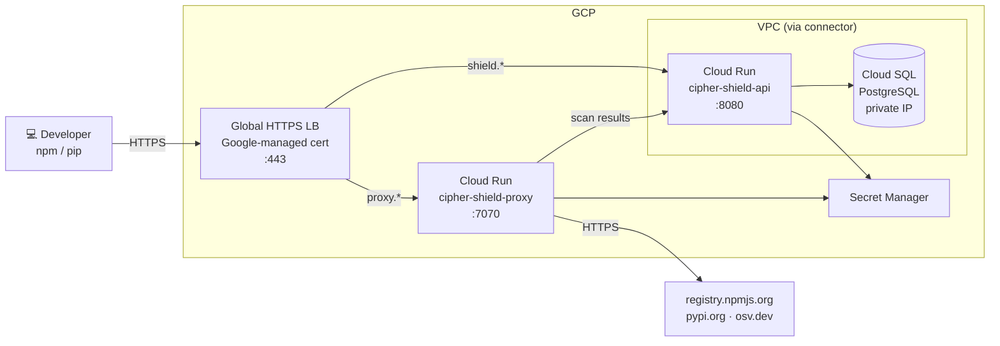

# Deploying cipher-shield on GCP (Terraform)

**Architecture:** Cloud Run + Cloud SQL PostgreSQL + Global HTTPS Load Balancer.  
Serverless containers — scales to zero when idle, Google-managed TLS certificate.  
**Estimated cost:** ~$15–30/month (Cloud Run billing is per-request when scaled to zero).



---

## Prerequisites

- [Terraform](https://developer.hashicorp.com/terraform/install) ≥ 1.6
- `gcloud` CLI installed and authenticated (`gcloud auth login`)
- A GCP project with billing enabled
- A domain you control with access to add DNS records

---

## Deploy

The Terraform module is included in this repo under `infra/gcp/`.

```bash
cd infra/gcp
cp terraform.tfvars.example terraform.tfvars
```

Generate secrets and fill in `terraform.tfvars`:

```bash
cat > terraform.tfvars << EOF
gcp_project       = "your-gcp-project-id"
gcp_region        = "us-central1"
domain            = "yourdomain.com"
db_password       = "$(openssl rand -hex 16)"
jwt_secret        = "$(openssl rand -hex 32)"
proxy_token       = "$(openssl rand -hex 32)"
anthropic_api_key = ""
image_tag         = "0.1.5"
EOF
```

> Save `terraform.tfvars` somewhere safe — these secrets are not recoverable after `terraform apply` without modifying the running infrastructure.

**Step 1 — reserve the static IP:**

```bash
terraform init
terraform apply -target=google_compute_global_address.shield
```

Get the IP address that was reserved:

```bash
terraform output lb_ip_address
```

**Step 2 — add DNS A records, then deploy everything:**

Add two A records to your DNS provider pointing at the static IP:

| Record | Type | Value |
|---|---|---|
| `shield.yourdomain.com` | A | IP from `lb_ip_address` |
| `proxy.yourdomain.com` | A | IP from `lb_ip_address` |

Then deploy:

```bash
terraform apply
```

This creates Cloud SQL, Cloud Run services, VPC connector, Secret Manager entries, and the Global Load Balancer. The Google-managed TLS certificate provisions automatically once the DNS records resolve — typically 10–20 minutes after propagation.

> Cloud SQL takes ~5 minutes to create. The full apply takes ~10 minutes.

---

## Bootstrap the first admin user

The `/api/v1/users` endpoint is open when the users table is empty. The first user created is forced to `admin`.

```bash
curl -X POST https://shield.yourdomain.com/api/v1/users \
  -H "Content-Type: application/json" \
  -d '{"email":"admin@yourcompany.com","password":"...","role":"admin"}'
```

Open `https://shield.yourdomain.com` and log in.

---

## Configure developer machines

```bash
# Point npm at cipher-shield (run on each developer machine, or push via MDM/Ansible)
npm config set registry https://proxy.yourdomain.com/

# Point pip at cipher-shield
pip config set global.index-url https://proxy.yourdomain.com/simple/
```

Scan results appear in the dashboard at `https://shield.yourdomain.com` automatically.

> **Corporate proxies and SWGs:** If your organization runs Cisco Umbrella, Zscaler, Netskope, or a corporate HTTP proxy, see [network.md](network.md) for the one-time policy changes needed.

---

## Upgrade

Update `image_tag` in `terraform.tfvars` and run:

```bash
terraform apply
```

Cloud Run performs a zero-downtime revision rollout.

---

## Teardown

Cloud SQL has deletion protection enabled by default to prevent accidental data loss. Disable it first, then destroy:

```bash
# Disable deletion protection on Cloud SQL
sed -i 's/deletion_protection = true/deletion_protection = false/' main.tf
terraform apply -target=google_sql_database_instance.pg

# Now destroy everything
terraform destroy
```

---

## Manual deployment

If you prefer not to use Terraform, see [deploy-gcp.md](deploy-gcp.md) for a step-by-step `gcloud` CLI walkthrough.
