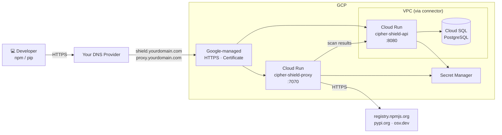

# Deploying cipher-shield on GCP

**Architecture:** Cloud Run + Cloud SQL PostgreSQL.  
Serverless containers — scales to zero when idle, auto-scales under load, fully managed.  
**Estimated cost:** ~$15–30/month (Cloud Run billing is per-request when scaled to zero).

---

## Architecture



---

## Prerequisites

- `gcloud` CLI installed and authenticated (`gcloud auth login`)
- A GCP project with billing enabled
- A domain you control with access to add DNS records

Enable all required APIs:

```bash
gcloud services enable \
  run.googleapis.com \
  sqladmin.googleapis.com \
  secretmanager.googleapis.com \
  vpcaccess.googleapis.com \
  servicenetworking.googleapis.com
```

---

## 1. Set variables

```bash
export PROJECT_ID=$(gcloud config get-value project)
export REGION=us-central1
export SQL_INSTANCE=cipher-shield-pg
export IMAGE=ghcr.io/cipher-oss/cipher-shield:latest
export DOMAIN=yourdomain.com   # replace with your domain
```

---

## 2. Store secrets in Secret Manager

```bash
JWT_SECRET=$(openssl rand -hex 32)
PROXY_TOKEN=$(openssl rand -hex 32)
DB_PASSWORD=$(openssl rand -hex 16)

echo -n "$JWT_SECRET"  | gcloud secrets create cipher-jwt-secret  --data-file=- --project=$PROJECT_ID
echo -n "$PROXY_TOKEN" | gcloud secrets create cipher-proxy-token --data-file=- --project=$PROJECT_ID
echo -n "$DB_PASSWORD" | gcloud secrets create cipher-db-password --data-file=- --project=$PROJECT_ID
```

---

## 3. Set up private service access for Cloud SQL

Cloud SQL private IP requires VPC peering between your VPC and Google's service network. This only needs to be done once per project.

```bash
gcloud compute addresses create google-managed-services-default \
  --global \
  --purpose=VPC_PEERING \
  --prefix-length=16 \
  --network=default \
  --project=$PROJECT_ID

gcloud services vpc-peerings connect \
  --service=servicenetworking.googleapis.com \
  --ranges=google-managed-services-default \
  --network=default \
  --project=$PROJECT_ID
```

> If your project already has private service access configured, skip this step.

---

## 4. Create Cloud SQL PostgreSQL

```bash
gcloud sql instances create $SQL_INSTANCE \
  --database-version=POSTGRES_16 \
  --tier=db-f1-micro \
  --region=$REGION \
  --no-assign-ip \
  --network=default

gcloud sql databases create shield --instance=$SQL_INSTANCE
gcloud sql users create shield --instance=$SQL_INSTANCE --password="$DB_PASSWORD"

DB_PRIVATE_IP=$(gcloud sql instances describe $SQL_INSTANCE --format=json \
  | jq -r '.ipAddresses[] | select(.type=="PRIVATE") | .ipAddress')
echo "DB_PRIVATE_IP=$DB_PRIVATE_IP"

DB_URL="postgres://shield:${DB_PASSWORD}@${DB_PRIVATE_IP}:5432/shield?sslmode=require"
echo -n "$DB_URL" | gcloud secrets create cipher-db-url --data-file=- --project=$PROJECT_ID
```

---

## 5. Create a VPC connector

Cloud Run needs a VPC connector to reach the Cloud SQL private IP.

```bash
gcloud compute networks vpc-access connectors create cipher-connector \
  --region=$REGION \
  --network=default \
  --range=10.8.0.0/28
```

---

## 6. Grant Secret Manager access to Cloud Run

```bash
PROJECT_NUMBER=$(gcloud projects describe $PROJECT_ID --format='value(projectNumber)')
SA="${PROJECT_NUMBER}-compute@developer.gserviceaccount.com"

for SECRET in cipher-jwt-secret cipher-proxy-token cipher-db-password cipher-db-url; do
  gcloud secrets add-iam-policy-binding $SECRET \
    --member="serviceAccount:$SA" \
    --role="roles/secretmanager.secretAccessor"
done
```

---

## 7. Deploy the API / dashboard (port 8080)

```bash
gcloud run deploy cipher-shield-api \
  --image=$IMAGE \
  --region=$REGION \
  --port=8080 \
  --vpc-connector=cipher-connector \
  --vpc-egress=private-ranges-only \
  --set-env-vars="SHIELD_MODE=enforce" \
  --set-secrets="SHIELD_JWT_SECRET=cipher-jwt-secret:latest,SHIELD_PROXY_TOKEN=cipher-proxy-token:latest,DATABASE_URL=cipher-db-url:latest" \
  --allow-unauthenticated \
  --min-instances=1 \
  --max-instances=4

API_URL=$(gcloud run services describe cipher-shield-api \
  --region=$REGION --format='value(status.url)')
echo "API URL: $API_URL"
```

---

## 8. Deploy the package proxy (port 7070)

Cloud Run only exposes one port per service, so the proxy runs as a second service targeting port 7070. It uses the standalone `cipher-shield-proxy` binary from the same image — no direct database connection needed. It ships scan results to the API service over HTTPS.

```bash
gcloud run deploy cipher-shield-proxy \
  --image=$IMAGE \
  --region=$REGION \
  --port=7070 \
  --command=cipher-shield-proxy \
  --set-env-vars="SHIELD_MODE=enforce,SHIELD_SERVER_URL=${API_URL}" \
  --set-secrets="SHIELD_PROXY_TOKEN=cipher-proxy-token:latest" \
  --allow-unauthenticated \
  --min-instances=1 \
  --max-instances=4

PROXY_URL=$(gcloud run services describe cipher-shield-proxy \
  --region=$REGION --format='value(status.url)')
echo "Proxy URL: $PROXY_URL"
```

---

## 9. Verify

```bash
curl $API_URL/api/v1/health
# {"status":"ok","version":"0.1.4"}
```

---

## 10. Bootstrap the first admin user

```bash
ADMIN_PASSWORD=$(openssl rand -hex 12)
echo "Admin password: $ADMIN_PASSWORD — save this before proceeding"
curl -X POST $API_URL/api/v1/users \
  -H "Content-Type: application/json" \
  -d "{\"email\":\"admin@yourcompany.com\",\"password\":\"${ADMIN_PASSWORD}\",\"role\":\"admin\"}"
```

This endpoint is open when the users table is empty; the first user is forced to `admin`.

---

## 11. Map custom domains

Cloud Run domain mappings provision a Google-managed certificate automatically once DNS is pointed at Google's servers. No manual cert request needed.

**Verify domain ownership** (one-time per root domain — adds a TXT record to your DNS):

```bash
gcloud domains verify $DOMAIN
```

Follow the prompts: add the TXT record shown to your DNS provider, then confirm in the CLI.

**Create the domain mappings:**

```bash
gcloud run domain-mappings create \
  --service cipher-shield-api \
  --domain shield.${DOMAIN} \
  --region $REGION

gcloud run domain-mappings create \
  --service cipher-shield-proxy \
  --domain proxy.${DOMAIN} \
  --region $REGION
```

**Get the DNS records to add:**

```bash
echo "=== shield.${DOMAIN} ==="
gcloud run domain-mappings describe \
  --domain shield.${DOMAIN} --region $REGION \
  --format='table(status.resourceRecords[].name,status.resourceRecords[].type,status.resourceRecords[].rrdata)'

echo "=== proxy.${DOMAIN} ==="
gcloud run domain-mappings describe \
  --domain proxy.${DOMAIN} --region $REGION \
  --format='table(status.resourceRecords[].name,status.resourceRecords[].type,status.resourceRecords[].rrdata)'
```

Add the CNAME records shown (they point to `ghs.googlehosted.com`) to your DNS provider. Google provisions the SSL certificate automatically once DNS propagates — typically 10–20 minutes.

**Check mapping status:**

```bash
gcloud run domain-mappings describe \
  --domain shield.${DOMAIN} --region $REGION \
  --format='value(status.conditions[].message)'
```

**Once both domains are active, update the proxy to use the stable custom domain:**

```bash
gcloud run services update cipher-shield-proxy \
  --region=$REGION \
  --update-env-vars="SHIELD_SERVER_URL=https://shield.${DOMAIN}"
```

---

## 12. Configure dev machines

**Option A — centralized proxy (no cipher-shield install required on each machine):**

```bash
npm config set registry https://proxy.${DOMAIN}/
pip config set global.index-url https://proxy.${DOMAIN}/simple/
```

Push this via MDM, Ansible, or your onboarding scripts. Scan results appear on the dashboard at `https://shield.${DOMAIN}` automatically.

**Option B — local proxy reporting to central server:**

```bash
export SHIELD_SERVER_URL=https://shield.${DOMAIN}
export SHIELD_PROXY_TOKEN=<PROXY_TOKEN from step 2>
cipher-shield proxy start
```

This starts a local proxy on `127.0.0.1:7070`, configures npm and pip automatically, and reports all results to the cloud server. If using this option, the proxy Cloud Run service (step 8) is optional.

---

## Scaling behavior

Both services scale 1–4 instances based on request concurrency. Set `--min-instances=0` to enable scale-to-zero. Keep the proxy at `--min-instances=1` to avoid cold start delays on `npm install` / `pip install`.

```bash
gcloud run services update cipher-shield-api \
  --region=$REGION --min-instances=0 --max-instances=10
```

---

## Corporate proxies and secure web gateways

If your organization runs Cisco Umbrella, Zscaler, Netskope, or a similar SWG, see **[Network and corporate proxy requirements →](network.md)** for the one-time policy changes needed to allow cipher-shield traffic through.

---

## Teardown

```bash
gcloud run domain-mappings delete shield.${DOMAIN} --region=$REGION -q
gcloud run domain-mappings delete proxy.${DOMAIN}  --region=$REGION -q
gcloud run services delete cipher-shield-api   --region=$REGION -q
gcloud run services delete cipher-shield-proxy --region=$REGION -q
gcloud sql instances delete $SQL_INSTANCE -q
gcloud compute networks vpc-access connectors delete cipher-connector --region=$REGION -q
gcloud secrets delete cipher-jwt-secret  -q
gcloud secrets delete cipher-proxy-token -q
gcloud secrets delete cipher-db-password -q
gcloud secrets delete cipher-db-url      -q
```
